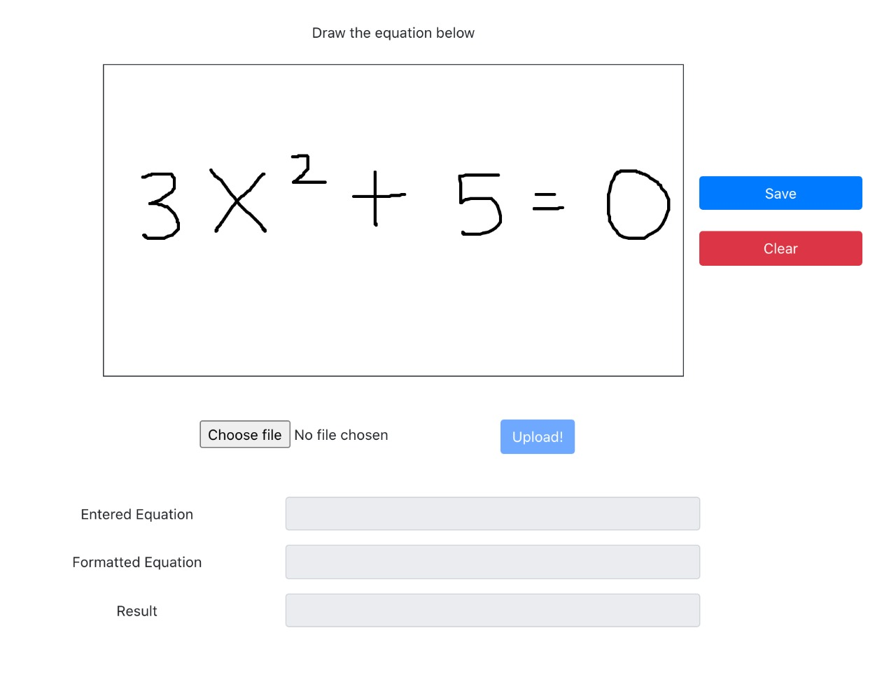
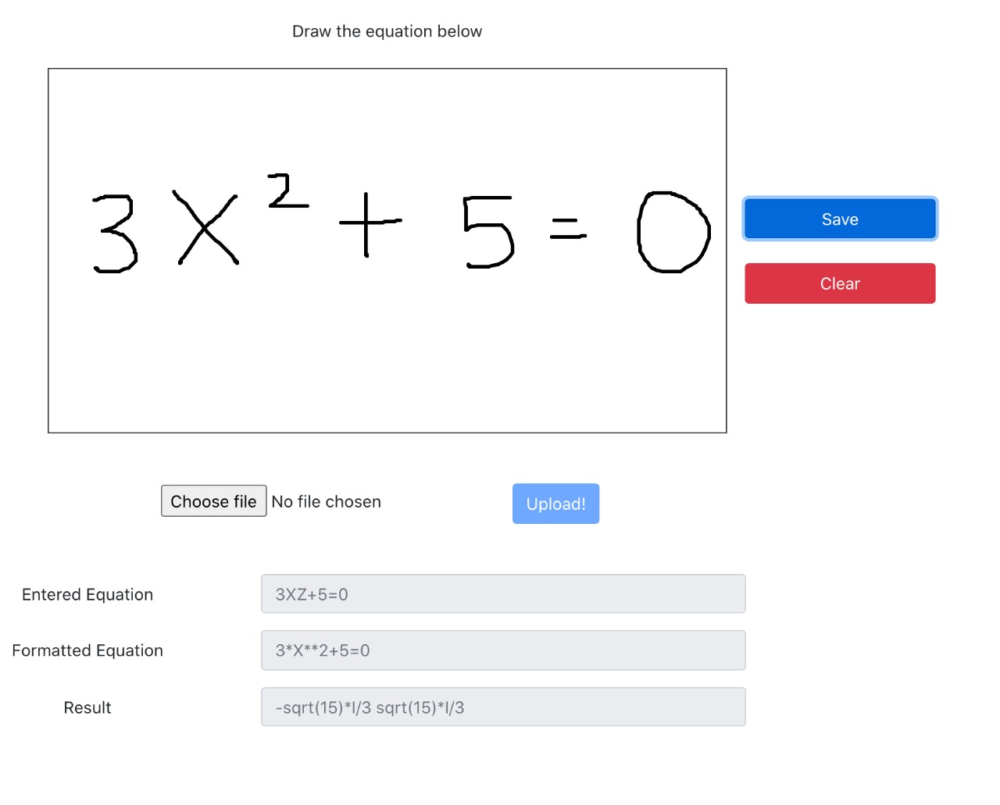
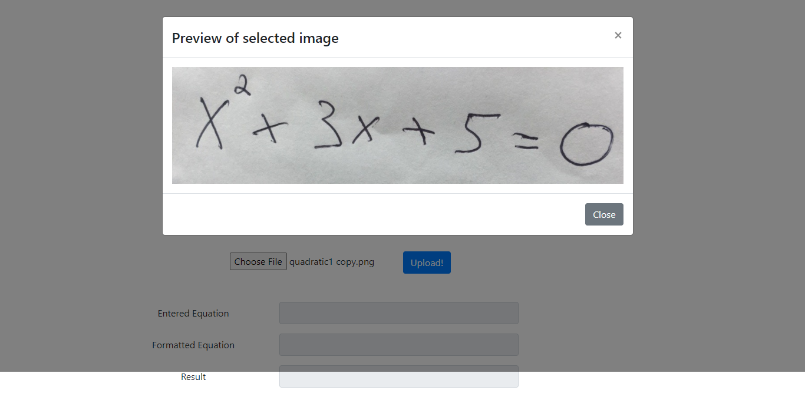
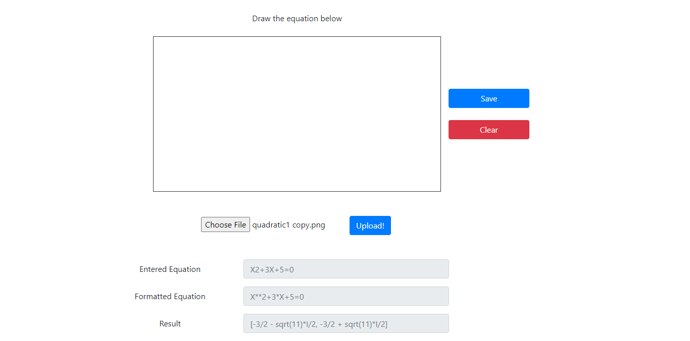
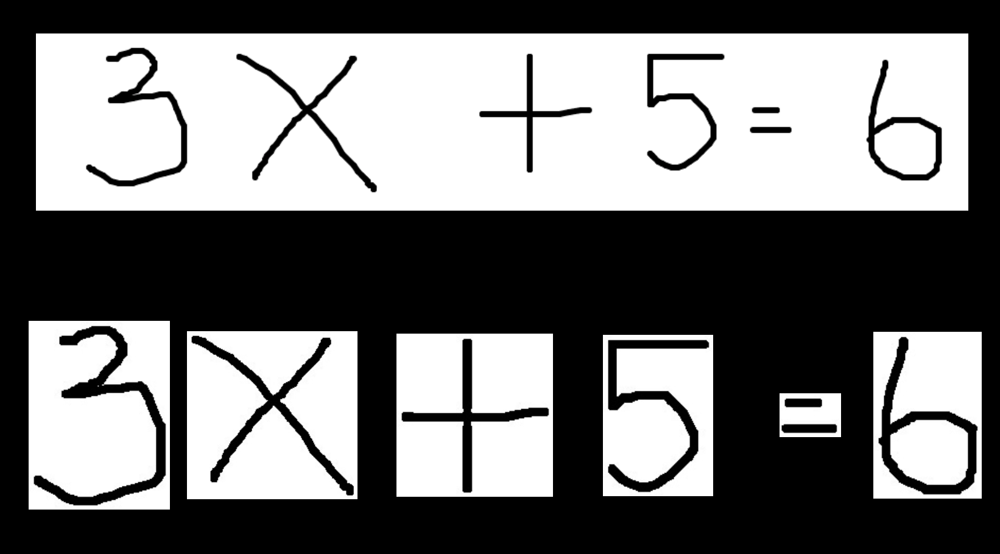
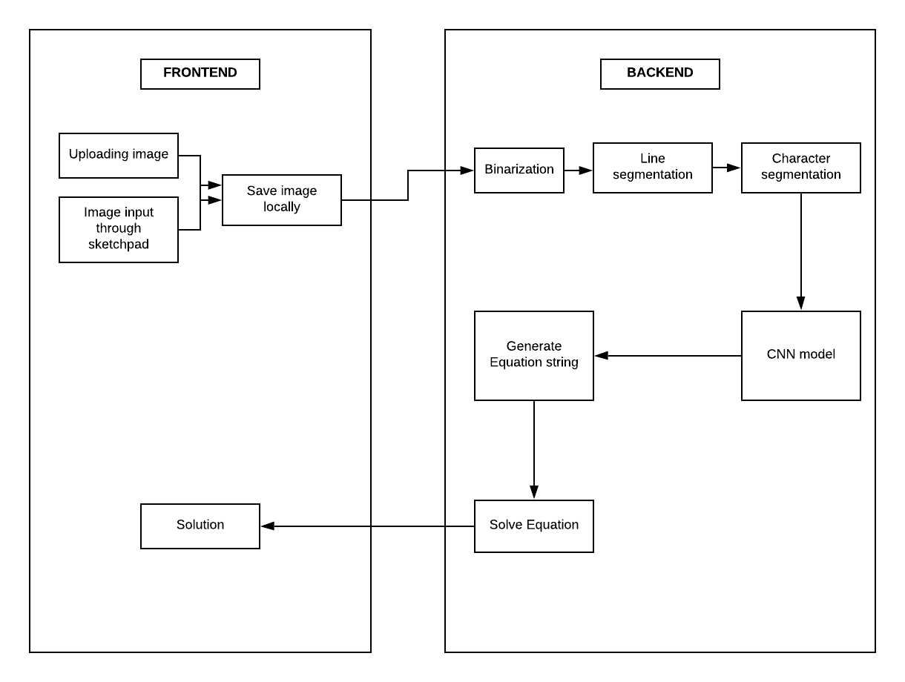

# Handwritten Mathematical Equation Solver

A full-stack application that recognizes and solves handwritten mathematical expressions and equations from an image or a digital sketchpad.

The system uses Optical Character Recognition (OCR), Convolutional Neural Networks (CNN), image processing, and symbolic computation to convert handwritten mathematical content into machine-readable expressions and generate the corresponding solution.

## Features

- Recognizes handwritten mathematical characters
- Supports drawing equations using a digital sketchpad
- Supports uploading handwritten equation images
- Performs image preprocessing and character segmentation
- Uses a CNN-based model for character recognition
- Supports arithmetic expressions such as addition, subtraction, multiplication, and division
- Solves mathematical equations of different degrees
- Provides a REST API for communication between the frontend and backend
- Supports Docker-based local deployment

## Tech Stack

### Frontend

- React.js
- JavaScript
- React-P5
- React Bootstrap

### Backend

- Python
- FastAPI
- REST API

### Machine Learning & Computer Vision

- TensorFlow / Keras
- Convolutional Neural Networks (CNN)
- OpenCV
- Optical Character Recognition (OCR)
- EMNIST dataset
- Image preprocessing
- Character segmentation

### Mathematical Processing

- SymPy
- Mathematical expression parsing and evaluation

### Deployment

- Docker
- Docker Compose

## System Architecture

```text
                         Handwritten Equation
                                  |
                    +-------------+-------------+
                    |                           |
               Image Upload              Digital Sketchpad
                    |                           |
                    +-------------+-------------+
                                  |
                                  v
                         React.js Frontend
                                  |
                                  v
                              REST API
                                  |
                                  v
                         FastAPI Backend
                                  |
                                  v
                         Image Preprocessing
                                  |
                                  v
                       Character Segmentation
                                  |
                                  v
                         CNN Character Model
                                  |
                                  v
                       Equation Reconstruction
                                  |
                    +-------------+-------------+
                    |                           |
               Expression                  Equation
                    |                           |
                    v                           v
               Evaluation                SymPy Solver
                    |                           |
                    +-------------+-------------+
                                  |
                                  v
                               Solution
```

## Project Structure

```text
handwritten-mathematical-equation-solver/
│
├── api/
│   ├── app.py
│   ├── calculator.py
│   ├── main.py
│   ├── mapper.csv
│   ├── model.h5
│   ├── segmentor.py
│   ├── requirements.txt
│   ├── templates/
│   │   └── index.html
│   └── version.txt
│
├── frontend/
│   ├── src/
│   ├── public/
│   ├── package.json
│   ├── package-lock.json
│   ├── Dockerfile
│   └── version.txt
│
├── images/
│   ├── architecture.png
│   ├── char-segmentation.png
│   ├── equation-solver.png
│   ├── sketchpad1.jpeg
│   ├── sketchpad2.jpeg
│   ├── uploaded1.png
│   └── uploaded2.png
│
├── docker-compose.yaml
└── README.md
```

## Key Workflow

1. The user uploads an image or draws a handwritten equation using the sketchpad.
2. The React.js frontend converts the image into Base64 format and sends it to the FastAPI backend.
3. OpenCV preprocesses the image using binarization, thresholding, noise removal, and character segmentation.
4. The segmented characters are passed to a CNN model trained using the EMNIST dataset for character recognition.
5. The recognized characters are reconstructed into a mathematical expression or equation.
6. Arithmetic expressions are evaluated, while mathematical equations are solved using SymPy.
7. The final solution is returned to the frontend and displayed to the user.

## Installation

### Prerequisites

Make sure the following are installed:

- Python 3.9+
- Node.js and npm
- Docker (optional)

### Backend Setup

Open a terminal in the project directory and run:

```bash
cd api
pip install -r requirements.txt
uvicorn app:app --port 8000 --reload
```

The FastAPI backend will be available at:

```text
http://localhost:8000
```

### Frontend Setup

Open another terminal and run:

```bash
cd frontend
npm install
npm run start
```

The React.js frontend will be available at:

```text
http://localhost:3000
```

### Docker Setup

Docker can be used to run the frontend and backend together.

From the project root directory, run:

```bash
docker-compose up --build
```

The application can then be accessed at:

```text
Frontend: http://localhost:3000
Backend:  http://localhost:8000
```

## Equation Processing

The system processes handwritten mathematical content through several stages.

### 1. Image Preprocessing

OpenCV is used to preprocess the input image through:

- Noise removal
- Image binarization
- Thresholding
- Line detection
- Character segmentation

### 2. Character Recognition

The segmented characters are passed individually to a CNN model trained on the EMNIST dataset.

The model predicts the characters present in the handwritten input.

### 3. Equation Reconstruction

The predicted characters are combined to reconstruct the original mathematical expression or equation.

### 4. Expression Evaluation

For arithmetic expressions such as:

```text
5+3
66x3+2
```

the reconstructed expression is evaluated to obtain the result.

### 5. Equation Solving

For equations containing `=`, the reconstructed expression is processed as a mathematical equation and solved using the SymPy library.

The system is designed to support equations of different degrees, including linear, quadratic, cubic, and higher-degree equations.

## Character Segmentation

Character segmentation is an important preprocessing step in the recognition pipeline.

The image processing pipeline includes:

- Noise removal
- Image binarization
- Thresholding
- Line detection
- Character segmentation

The segmented characters are then passed individually to the CNN character recognition model.

## Equation Solver

After character recognition, the predicted characters are reconstructed into a mathematical expression or equation.

The system handles two types of input:

### Arithmetic Expressions

Examples:

```text
5+3
66x3+2
```

These expressions are evaluated to produce the corresponding numerical result.

### Mathematical Equations

Equations containing `=` are processed using SymPy.

For example:

```text
X2+5=0
```

is interpreted as:

```text
X**2 + 5 = 0
```

Similarly:

```text
2X+5=0
```

is interpreted as:

```text
2*X + 5 = 0
```

Since recognition of individual handwritten characters can sometimes lead to incorrect predictions, simple character replacements are performed to improve accuracy.

Examples include:

```text
Z → 2
G → 6
B → 8
D → 0
```

The presence of `=` is used to distinguish between arithmetic expressions and mathematical equations.

## Results

### When Image Is Drawn Through the Sketchpad

<p align="center">
  
</p>

<p align="center">
  
</p>

### When Image Is Uploaded

<p align="center">
  
</p>

<p align="center">
  
</p>

### Character Segmentation

<p align="center">
  
</p>

### System Architecture

<p align="center">
  
</p>

## Original Project

The original application was previously deployed online but is currently unavailable because the hosting platform used for deployment discontinued its free product plans.

## References

- Introduction to CNN Keras
- Character Segmentation
- React.js Getting Started
- React-P5 Wrapper
- React Bootstrap

## Contributing

Contributions and pull requests are welcome.

If you would like to improve the project, feel free to submit an issue or create a pull request.
